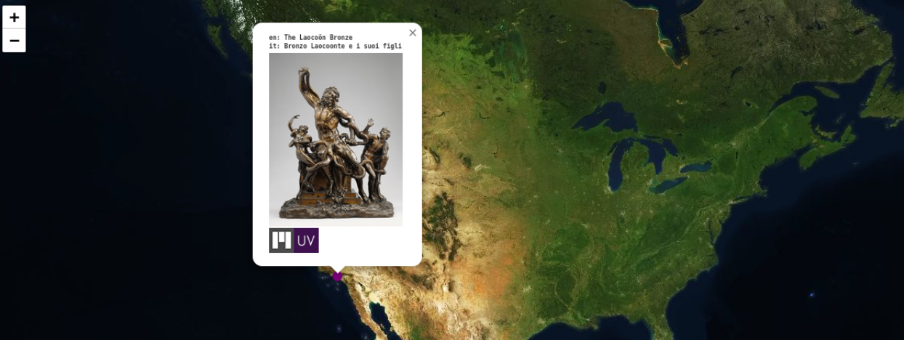
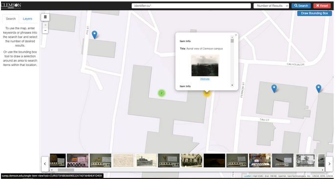

==========
Image Work
==========

-----
About
-----

Image works are works where the primary fileset is derived from an image file such as a :code:`TIF`, :code:`JP2`, or
:code:`JPEG`. The fileset is served by a IIIF Image Server and passed to a IIIF viewer on the Work page by a IIIF
Presentation 3 manifest.

The image work MAY be represented by :code:`pcdmuse:IntermediateFile` and a :code:`pcdmuse:PreservationFile`. The
:code:`pcdmuse:IntermediateFile` should always be served to the viewer on the work page. In the case where there
are 2 separate filesets, the :code:`pcdmuse:IntermediateFile` has had additional processing done to it beyond what would
happen through standard programmatic derivative generation and thus may be in a separate fileset from the
:code:`pcdmuse:IntermediateFile`. Thumbnail generation should always be done with whichever fileset includes the
:code:`pcdmuse:IntermediateFile`. In the case that there is only one fileset, that fileset should have both a
:code:`pcdmuse:Preservation File` and :code:`pcdmuse:IntermediateFile` type.

An image work may have other filesets of any mime-type available for download.

All filesets may have restrictions that prohibit view / access.

-------------------
Metadata Properties
-------------------

Descriptive Properties
======================

Descriptive properties are described in our
`vendor supplied MAP <https://docs.google.com/spreadsheets/d/1_0QVbQU_wj3ITUih5dGPGkWHN0QyhGO9hKSf6rXwKPc/edit#gid=0>`_.

Structural Properties
=====================

The suggested structure of an image work with a :code:`pcdmuse:IntermediateFile` and :code:`pcdmuse:PreservationFile`.

.. literalinclude:: ../fixtures/image.ttl
    :language: turtle
    :linenos:

Technical Properties
====================

Technical properties are identified and listed in our
`metadata application profile <https://docs.google.com/spreadsheets/d/1_0QVbQU_wj3ITUih5dGPGkWHN0QyhGO9hKSf6rXwKPc/edit#gid=0>`_
in the files tab.

------------------
Viewing Experience
------------------

IIIF Viewer
===========

Image works should be displayed in a IIIF viewer such as Universal Viewer, Clover IIIF, or Mirador. The IIIF viewer
should provide pan and zoom from the embedded OpenSeaDragon viewer. Our current IIIF configuration along with “viewing
experience” for images is described in our
`Large Image IIIF Recipe document <https://utk-iiif-cookbook.readthedocs.io/en/latest/contents/images.html>`_.

The :code:`pcdmuse:IntermediateFile` should always be displayed in the viewer by default. In the case that filesets are
represented by a web uri with a viewer, it is okay that the :code:`pcdmuse:PreservationFile` renders when that page is
accessed.

A TIF or JP2 image in the viewer should look something like this:

A JPEG in the viewer should look something like this:

Location-based Viewing
======================

Our metadata currently includes cartographic and coordinate information so that the metadata record can be easily intermixed with a location-based viewer. An item should not be playable from this view, but it should pop out into a new window. We also include a URI that points at a Geonames object that includes this same information.

If needed, we can continue to store cartographic and coordinate information in a separate field to make this easy.

Some sample location-based display might be:

.. figure:: ../images/location_based_2.png
    :alt: Location-based Example 2

.. figure:: ../images/location_based_3.png
    :alt: Location-based Example 3

If possible, we would also like our location information to be shared as a `navPlace` extension in our IIIF manifests.

Rights Viewing
==============

While we store our rights as uris (see metadata application profile), we’d like these statements to be actionable and
render the appropriate badge and usage information to the user in both the IIIF viewer (when metadata is on) and in our
metadata display below.

.. figure:: ../images/image_rights.png
    :alt: Image Rights Example

File Viewer
===========

Users should be able to easily download the primary filesets.

If a fileset is only a `pcdm:PreservationFile` it should never be publicly visible.

.. figure:: ../images/file_download.png
    :alt: File Download Example

----------------
Interoperability
----------------

OAI-PMH
=======

Like other work types, image works should be represented by an OAI-PMH record based on its metadata application profile.
The work should be a record in an OAI set for each corresponding collection to which the work belongs. Our metadata
application profile should have a rule that states which field values should be transformed to OAI-PMH for a given
metadata format (simple dublin core, qualified DublinCore, DPLA?).

IIIF Image
==========

All images should be served by a IIIF image service that adheres to at least IIIF Image API 2.1.1 that supports most
features described in `5.3 profile description <https://iiif.io/api/image/2.1/#profile-description>`_. As part of work
type negotiation, we would like to know any features that the IIIF Image service does not support.

IIIF Presentation v3
====================

All image works should have a corresponding IIIF presentation v3 manifest that allows the object to be shared and
remixed in other projects. For our current system, we have a description of our current presentation 3 mapping in the
`corresponding recipe <https://utk-iiif-cookbook.readthedocs.io/en/latest/contents/images.html>`_.

-------
Bulkrax
-------

Import
======

Like all work types, images should be importable according to our Metadata Application Profile via Bulkrax import using
CSV and XXXXXXX file storage solution.

Export
======

In addition to import functionality, images should have a variety of export options including the ability to export only
filesets related to preservation for easy transfer to Chronopolis.  Those filesets should include:

* :code:`pcdmuse:PreservationFile`

------------
Restrictions
------------

Like other work types, video works may have restrictions at the work and fileset / file level.

