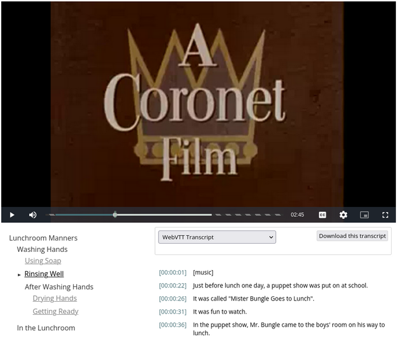
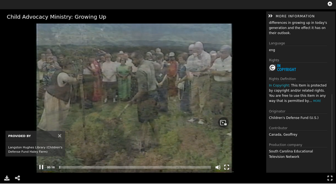

==========
Video Work
==========

-----
About
-----

Video works are works where the primary fileset is derived from a video file. The file should be served to a IIIF viewer
on the Work page by a IIIF Presentation 3 manifest.

The video work MAY have a :code:`pcdmuse:IntermediateFile` and a :code:`pcdmuse:PreservationFile` that represents the
video. In the case that there is only one file, the primary fileset should have a file that is both a
:code:`pcdmuse:IntermediateFile` and a :code:`pcdmuse:PreservationFile`. That way, the :code:`pcdmuse:IntermediateFile`
will always be served to the viewer on the work page. In the case where there are 2 separate files, the one with a type
of :code:`pcdmuse:IntermediateFile` has had additional processing done to it beyond what would happen through standard
programmatic derivative generation and thus MAY need to live in its own fileset. The representative thumbnail should
always be derived from the file with a :code:`rdf:type` of :code:`pcdmuse:IntermediateFile`. In the case that there is
only one fileset, that fileset should have a file with two rdf:types: :code:`pcdmuse:PreservationFile` and
:code:`pcdmuse:IntermediateFile`. The `pcdmuse:IntermediateFile` should always served to the viewer on the work page.

Video works should have caption or transcript files and may have them in multiple languages.

Video works may have hierarchical structure described by metadata properties that should be converted into IIIF
Presentation v3 `structures and ranges <https://iiif.io/api/presentation/3.0/#structures>`_.

A video work may have other filesets of any mime type available to the user for download.

All filesets may have restrictions that prohibit view / access.

-------------------
Metadata Properties
-------------------

Descriptive Properties
======================

Descriptive properties are described in our
`vendor supplied MAP <https://docs.google.com/spreadsheets/d/1_0QVbQU_wj3ITUih5dGPGkWHN0QyhGO9hKSf6rXwKPc/edit#gid=0>`_.

Structural Properties
=====================

The suggested structure of an video work is described below.

.. literalinclude:: ../fixtures/video.ttl
    :language: turtle
    :linenos:

Technical Properties
====================

Technical properties are identified and listed in our
`metadata application profile <https://docs.google.com/spreadsheets/d/1_0QVbQU_wj3ITUih5dGPGkWHN0QyhGO9hKSf6rXwKPc/edit#gid=0>`_
in the files tab.

------------------
Viewing Experience
------------------

IIIF Viewer
===========

Video works should be rendered to the user in a IIIF presentation viewer like IIIF React Media Player, Universal Viewer,
Clover IIIF, or Mirador. Our current IIIF configuration along with “viewing experience” for images is described in our
`Video IIIF Recipe document <https://utk-iiif-cookbook.readthedocs.io/en/latest/contents/video.html>`_.

In the case where a Video work has a :code:`pcdmuse:PreservationFile` and :code:`pcdmuse:IntermediateFile` file, the
`pcdmuse:IntermediateFile` should be displayed in the viewer to users by default on the work page. A work may have both
types of files when the intermediate is not derived programmatically from the preservation file.

While we expect to use a IIIF viewer for display, it is important to note that we have closed captioning files and
structural metadata that should be transformed into IIIF structures and ranges. Currently, we use our own internal viewer
for displaying this, but we should adopt a community viewer.  As of the time of this writing, only the
`IIIF React Media Player <https://github.com/samvera-labs/iiif-react-media-player>`_ supports this as part of its
:code:`<StructuredNavigation />` component. To keep things simple, we are okay with using this viewer for all audio and
video works. A sample of this viewer can be seen here and below:

Our current viewer with structures and ranges can be seen here:

In addition to structures and ranges, most of our audio and video works have caption files and transcripts in 1 or more
languages.  It is critical that the viewer display our different caption files and that these are stored in the
corresponding IIIF manifest as an annotation with a motivation of :code:`supplementing` in the annotations property in
line with the IIIF presentation v3 specification and W3C Web Annotations specification. If helpful, see our Video IIIF
Recipe documentation for how this should be implemented.

Minimally, the caption file should be displayed as captions but may also be present as a navigable transcript like in
Clover IIIF:

Location-based Viewing
======================

Our metadata currently includes cartographic and coordinate information so that the metadata record can be easily intermixed with a location-based viewer. An item should not be playable from this view, but it should pop out into a new window. We also include a URI that points at a Geonames object that includes this same information.

If needed, we can continue to store cartographic and coordinate information in a separate field to make this easy.

Some sample location-based display might be:

.. figure:: ../images/location_based_1.png
    :alt: Location-based Example 1

.. figure:: ../images/location_based_2.png
    :alt: Location-based Example 2

.. figure:: ../images/location_based_3.png
    :alt: Location-based Example 3

.. figure:: ../images/clemson_location.png
    :alt: Location-based Example 4

If possible, we would also like our location information to be shared as a `navPlace` extension in our IIIF manifests.

Rights Viewing
==============

While we store our rights as uris (see metadata application profile), we’d like these statements to be actionable and
render the appropriate badge and usage information to the user in both the IIIF viewer (when metadata is on) and in our
metadata display below.

File Viewer
===========

Users should be able to easily download the primary filesets.

If a fileset is only a `pcdm:PreservationFile` it should never be publicly visible.

.. figure:: ../images/file_download.png
    :alt: File Download Example

----------------
Interoperability
----------------

OAI-PMH
=======

Like other work types, video works should be represented by an OAI-PMH record based on its metadata application profile.
The work should be a record of an OAI set for each corresponding collection to which the object belongs. Our metadata
application profile should have a rule that states which field values should be remixed to OAI-PMH for a given metadata
format (simple dublin core, dcterms).

IIIF Presentation v3
====================

All video works should have a corresponding IIIF presentation v3 manifest that allows the object to be shared and
remixed in other projects. For our current system, we have a description of our current presentation 3 mapping in the
`corresponding recipe <https://utk-iiif-cookbook.readthedocs.io/en/latest/contents/video.html>`_.

For video works, our expectations are that structures and ranges be stored in the structures
property with accompanying ranges that target the video canvas.  Also, all caption files should be annotations in the
annotations property with the motivation of supplementing.

-------
Bulkrax
-------

Import
======

Like all work types, images should be importable according to our Metadata Application Profile via Bulkrax import using
CSV and XXXXXXX file storage solution.

Export
======

In addition to import functionality, images should have a variety of export options including the ability to export only
filesets related to preservation for easy transfer to Chronopolis.  Those filesets should be:

* :code:`pcdmuse:PreservationFile`

---------
Analytics
---------

------------
Restrictions
------------

Like other work types, video works may have restrictions at the work and fileset / file level.

------------
For UTK Only
------------

Migration Notes
===============
