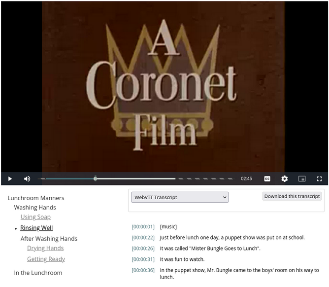
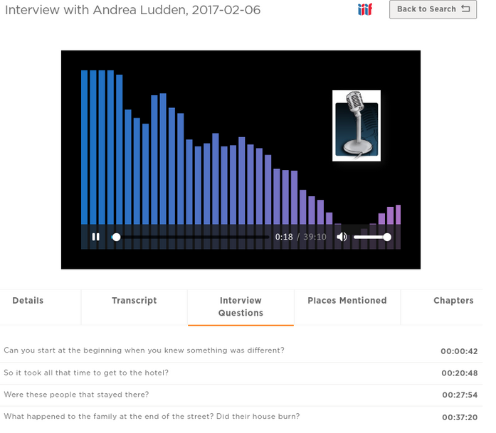
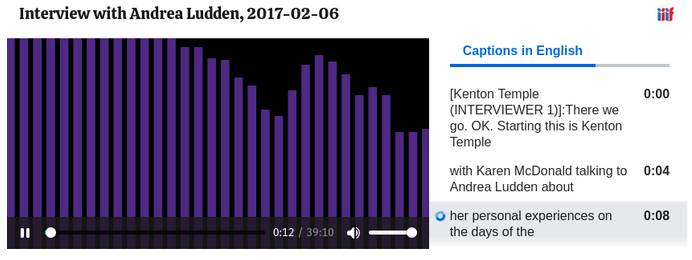
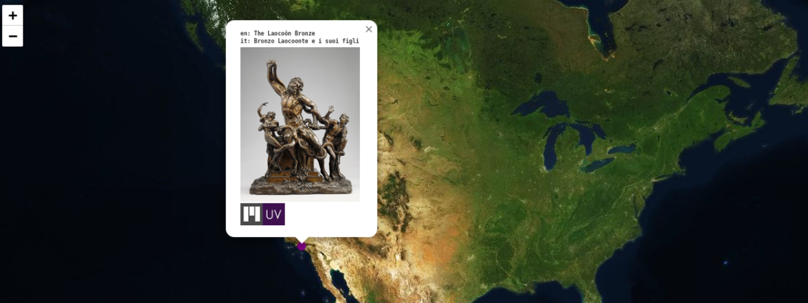
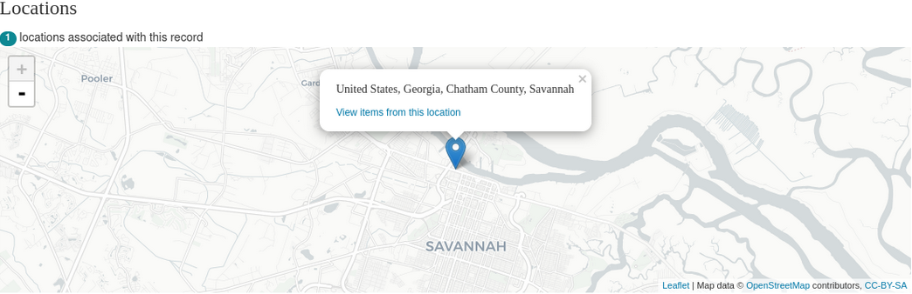
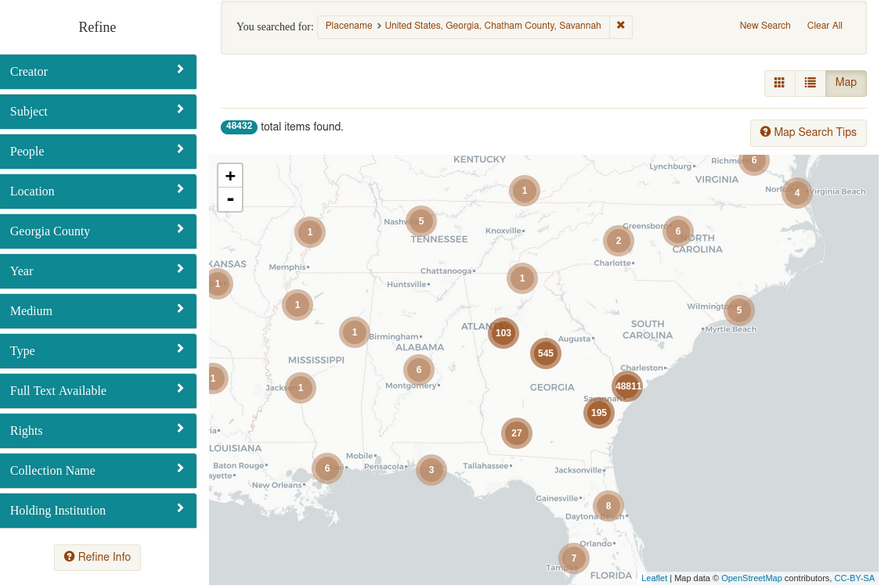
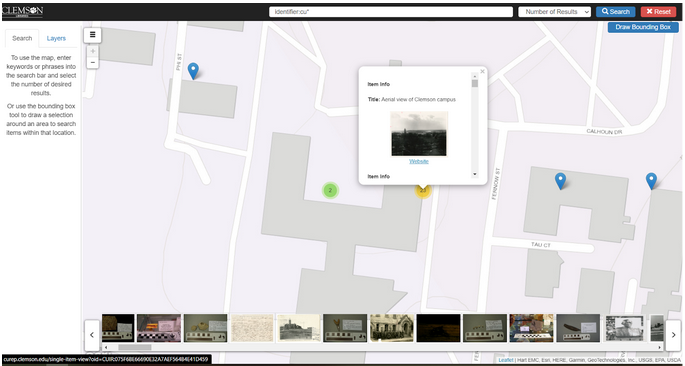
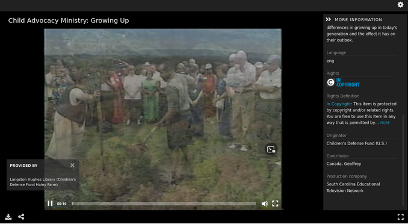
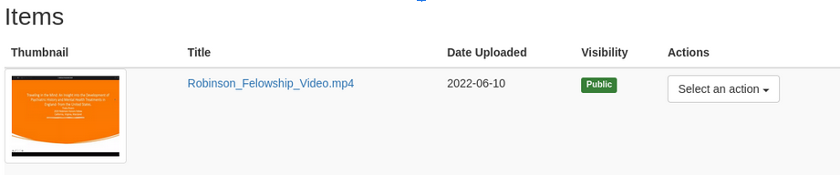

==========
Audio Work
==========

-----
About
-----

Audio works are works where the primary fileset(s) are derived from one or more audio files. The fileset(s) should be
served to a IIIF viewer on the Work page by a IIIF Presentation 3 manifest. While there may be multiple filesets, there
should only be one canvas with multiple annotations.

The audio work MAY have a :code:`pcdmuse:IntermediateFile` and a :code:`pcdmuse:PreservationFile`. In the case that
there is only one file, that fileset should include a  file that is both a :code:`pcdmuse:IntermediateFile` and a
:code:`pcdmuse:PreservationFile`. That way, the :code:`pcdmuse:IntermediateFile` will always be served to the viewer on
the work page. In the case where there are 2 files, the `pcdmuse:IntermediateFile` has had additional processing done to
it beyond what would happen through standard programmatic derivative generation and thus may need to be in its own
fileset. The representative thumbnail for the work should be derived from the :code:`pcdmuse:IntermediateFile` when it
is not curated. In the case that there is only one file, the file should be both a :code:`pcdmuse:PreservationFile` and
a :code:`pcdmuse:IntermediateFile`.

Audio works may have closed-captioning or transcript files and may have them in multiple languages.

Audio works may have hierarchical structure described by metadata properties that should be converted into IIIF
Presentation structures and ranges and therefore :code:`pcdmworks:Range` and :code:`pcdmworks:TopRange`s.

An audio work may have other filesets of any mime type available to the user for download.

All filesets may have restrictions that prohibit view / access.

-------------------
Metadata Properties
-------------------

Descriptive Properties
======================

Descriptive properties are described in our
`vendor supplied MAP <https://docs.google.com/spreadsheets/d/1_0QVbQU_wj3ITUih5dGPGkWHN0QyhGO9hKSf6rXwKPc/edit#gid=0>`_.

Structural Properties
=====================

Audio works may be derived from one or more filesets but will always be treated as a single canvas in the viewer.

Suggested structure for 1 primary fileset is described here.

.. literalinclude:: ../fixtures/audio_1file.ttl
    :language: turtle
    :linenos:

Suggested structure for more than one fileset is described here.

.. literalinclude:: ../fixtures/audio_multiple_files.ttl
    :language: turtle
    :linenos:

Technical Properties
====================

Technical properties are identified and listed in our
`metadata application profile <https://docs.google.com/spreadsheets/d/1_0QVbQU_wj3ITUih5dGPGkWHN0QyhGO9hKSf6rXwKPc/edit#gid=0>`_
in the files tab.

------------------
Viewing Experience
------------------

IIIF Viewer
===========

Audio works should be rendered to the user in a IIIF presentation viewer like IIIF React Media Player, Universal Viewer,
Clover IIIF, or Mirador. Our current IIIF configuration along with “viewing experience” for images is described in our
`Audio IIIF Recipe document <https://utk-iiif-cookbook.readthedocs.io/en/latest/contents/audio.html>`_.

In the case where a Audio work has a :code:`pcdmuse:PreservationFile` and :code:`pcdmuse:IntermediateFile` file, the
`pcdmuse:IntermediateFile` should be displayed in the viewer to users by default on the work page. A work may have both
types of files when the intermediate is not derived programmatically from the preservation file.

An audio work may also have multiple files that should be served to the single canvas in the :code:`items` property.

While we expect to use a IIIF viewer for display, it is important to note that we have closed captioning files and
structural metadata that should be transformed into IIIF structures and ranges. Currently, we use our own internal viewer
for displaying this, but we should adopt a community viewer.  As of the time of this writing, only the
`IIIF React Media Player <https://github.com/samvera-labs/iiif-react-media-player>`_ supports this as part of its
:code:`<StructuredNavigation />` component. To keep things simple, we are okay with using this viewer for all audio and
video works. A sample of this viewer can be seen here and below:

Our current viewer with structures and ranges can be seen here:

In addition to structures and ranges, most of our audio and video works have caption files and transcripts in 1 or more
languages. HTML 5 does not support caption files for audio, so showing the caption as a navigable transcript is
important. Here is an example of one of our current audio objects in Clover IIIF:

If helpful, see our `Audio IIIF Recipe documentation<https://utk-iiif-cookbook.readthedocs.io/en/latest/contents/audio.html>`_
for how this should be implemented.

Location-based Viewing
======================

Our metadata currently includes cartographic and coordinate information so that the metadata record can be easily intermixed with a location-based viewer. An item should not be playable from this view, but it should pop out into a new window. We also include a URI that points at a Geonames object that includes this same information.

If needed, we can continue to store cartographic and coordinate information in a separate field to make this easy.

Some sample location-based display might be:

If possible, we would also like our location information to be shared as a :code:`navPlace` extension in our IIIF
manifests.

Rights Viewing
==============

While we store our rights as uris (see metadata application profile), we’d like these statements to be actionable and
render the appropriate badge and usage information to the user in both the IIIF viewer (when metadata is on) and in our
metadata display below.

File Viewer
===========

Users should be able to easily download the primary filesets.

If a fileset is only a `pcdm:PreservationFile` it should never be publicly visible.

----------------
Interoperability
----------------

OAI-PMH
=======

Like other work types, audio works should be represented by an OAI-PMH record based on its metadata application profile.
The work should be a record of an OAI set for each corresponding collection to which the object belongs. Our metadata
application profile should have a rule that states which field values should be remixed to OAI-PMH for a given metadata
format (simple dublin core, dcterms).

IIIF Presentation v3
====================

All audio works should have a corresponding IIIF presentation v3 manifest that allows the object to be shared and
remixed in other projects. For our current system, we have a description of our current presentation 3 mapping in the
`corresponding recipe <https://utk-iiif-cookbook.readthedocs.io/en/latest/contents/audio.html>`_.

For audio works, our expectations are that structures and ranges be stored in the structures
property with accompanying ranges that target the video canvas.  Also, all caption files should be annotations in the
annotations property with the motivation of supplementing.

Finally, audio works should always be single canvased.  If there are multiple files, they should be ordered based on
the corresponding :code:`ore:Proxy` like `this example <https://gist.github.com/markpbaggett/f742e2bc857d2e76de8fdcbeb002c3fc>`_.

-------
Bulkrax
-------

Import
======

Like all work types, images should be importable according to our Metadata Application Profile via Bulkrax import using
CSV and XXXXXXX file storage solution.

Export
======

In addition to import functionality, images should have a variety of export options including the ability to export only
filesets related to preservation for easy transfer to Chronopolis.  Those filesets should be:

* :code:`pcdmuse:PreservationFile`

---------
Analytics
---------

------------
Restrictions
------------

Like other work types, video works may have restrictions at the work and fileset / file level.

------------
For UTK Only
------------

Migration Notes
===============
