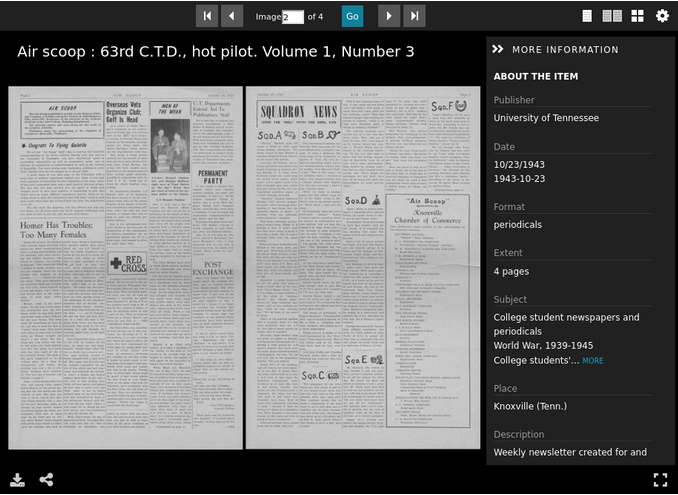
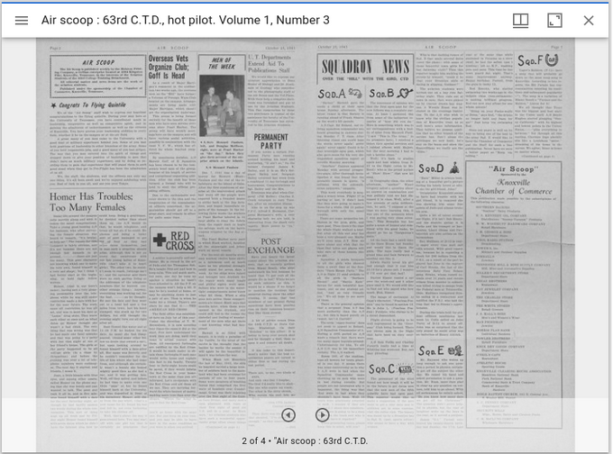
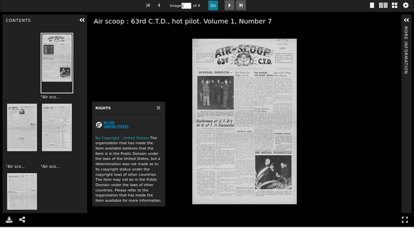

====================
Books and Pages Work
====================

-----
About
-----

Book works are works that are made up of 1 to many pages that are intended to be served in a IIIF viewer as a paged object.

Book works are works where the object is an ordered aggregation of :code:`1-n` pages. The book should be made up of
:code:`1-n` :code:`pcdmuse:Object` s with each set representing an individual page. Each page will be derived
from a JP2 or TIF. Each fileset should have :code:`0-1` :code:`iana:next` and :code:`0-1` :code:`iana:prev` properties
that point to either the next or previous fileset in the sequence. It also has a :code:`pcdm:memberOf` property that
points at the book. The book should have a :code:`pcdm:hasMember` property that points at each page fileset and one
:code:`iana:first` and one :code:`iana:last` properties that point to the first and last page of the work.

Each page object MAY have a :code:`pcdmuse:IntermediateFile` and a :code:`pcdmuse:PreservationFile`. The
:code:`pcdmuse:IntermediateFile` should always be served to the viewer on the work page. In the case where there are both,
the :code:`pcdmuse:IntermediateFile` has had additional processing done to it beyond what would happen through standard
programmatic derivative generation and thus needs its own fileset and :code:`rdf:type`. Thumbnail generation should
always be done against the :code:`pcdmuse:IntermediateFile`. In the case that there is only file, the file should be
both a :code:`pcdmuse:PreservationFile` and :code:`pcdmuse:IntermediateFile`. The `pcdmuse:IntermediateFile` is always
served in the viewer.

All books should have an auto-generated PDF that is searchable and available for download.

All pages should have OCR and HOCR.

A book work may have other filesets of any mime-type available for download.

All filesets may have restrictions that prohibit view / access.

A page object may have a property indicating that it is unordered that should be translated to the corresponding IIIF
presentation manifest as such.

-------------------
Metadata Properties
-------------------

Descriptive Properties
======================

Descriptive properties are described in our
`vendor supplied MAP <https://docs.google.com/spreadsheets/d/1_0QVbQU_wj3ITUih5dGPGkWHN0QyhGO9hKSf6rXwKPc/edit#gid=0>`_.

Structural Properties
=====================

Suggested structure for a book is described here.

.. literalinclude:: ../fixtures/book.ttl
    :language: turtle
    :linenos:

Technical Properties
====================

Technical properties are identified and listed in our
`metadata application profile <https://docs.google.com/spreadsheets/d/1_0QVbQU_wj3ITUih5dGPGkWHN0QyhGO9hKSf6rXwKPc/edit#gid=0>`_
in the files tab.

------------------
Viewing Experience
------------------

IIIF Viewer
===========

Book works should be displayed in a IIIF viewer such as Universal Viewer, Clover IIIF, or Mirador with a “paged” /
“2-up” behavior by default. The IIIF viewer should provide pan and zoom from the embedded OpenSeaDragon viewer. Our
current IIIF configuration along with “viewing experience” for books and pages is described in our Books and Pages
`recipe document <https://utk-iiif-cookbook.readthedocs.io/en/latest/contents/books.html>`_.

The :code:`pcdmuse:IntermediateFile` should always be representative of the corresponding page in the book in the viewer
by default.

A paged book should look something like this:

It is important to note that while Universal Viewer allows users to switch between paged and non-paged views, other
viewers do not.  For that reason, it is important to us that book works specify this behavior in the corresponding
manifest.

Location-based Viewing
======================

Our metadata currently includes cartographic and coordinate information so that the metadata record can be easily intermixed with a location-based viewer. An item should not be playable from this view, but it should pop out into a new window. We also include a URI that points at a Geonames object that includes this same information.

If needed, we can continue to store cartographic and coordinate information in a separate field to make this easy.

Some sample location-based display might be:

.. figure:: ../images/location_based_1.png
    :alt: Location-based Example 1

.. figure:: ../images/location_based_2.png
    :alt: Location-based Example 2

.. figure:: ../images/location_based_3.png
    :alt: Location-based Example 3

.. figure:: ../images/clemson_location.png
    :alt: Location-based Example 4

If possible, we would also like our location information to be shared as a :code:`navPlace` extension in our IIIF
manifests.

Rights Viewing
==============

While we store our rights as uris (see metadata application profile), we’d like these statements to be actionable and
render the appropriate badge and usage information to the user in both the IIIF viewer (when metadata is on) and in our
metadata display below.

File Viewer
===========

Users should be able to easily download the primary filesets.

If a fileset is only a `pcdm:PreservationFile` it should never be publicly visible.

.. figure:: ../images/file_download.png
    :alt: File Download Example

----------------
Interoperability
----------------

OAI-PMH
=======

Like other work types, book works should be represented by an OAI-PMH record based on its metadata application profile.
The work should be a record in an OAI set for each corresponding collection to which the work belongs. Our metadata
application profile should have a rule that states which field values should be transformed to OAI-PMH for a given
metadata format (simple dublin core, qualified DublinCore, DPLA?)

Page works should not be represented by an OAI-PMH record.

IIIF Image
==========

All pages should be served by a IIIF image service that adheres to at least IIIF Image API 2.1.1 that supports most
features described in `5.3 profile description <https://iiif.io/api/image/2.1/#profile-description>`_. As part of work
type negotiation, we would like to know any features that the IIIF Image service does not support.

IIIF Presentation v3
====================

All book works should have a corresponding IIIF presentation v3 manifest that allows the object to be shared and remixed
in other projects. For our current system, we have a description of our current presentation 3 mapping in the
`corresponding recipe <https://utk-iiif-cookbook.readthedocs.io/en/latest/contents/books.html>`_.

-------
Bulkrax
-------

Import
======

Like all work types, images should be importable according to our Metadata Application Profile via Bulkrax import using
CSV and XXXXXXX file storage solution.

Export
======

In addition to import functionality, images should have a variety of export options including the ability to export only
filesets related to preservation for easy transfer to Chronopolis.  Those filesets should include:

* RDF about the :code:`pcdmworks:Work`
* RDF about the :code:`ore:Proxy`
* RDF about the pages
* :code:`pcdmuse:PreservationFile`

------------
Restrictions
------------

Like other work types, video works may have restrictions at the work and fileset / file level.

