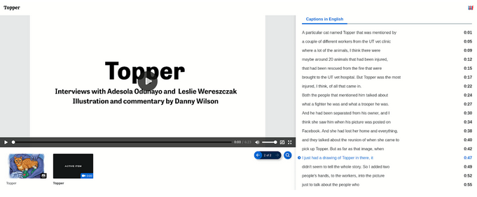
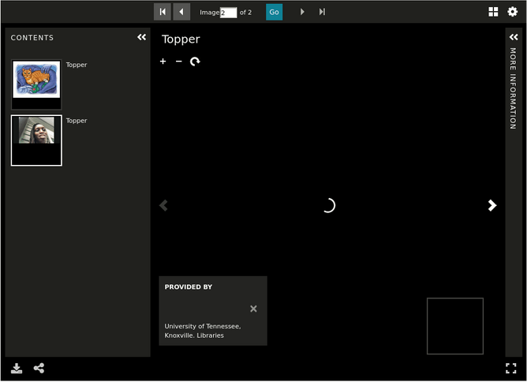
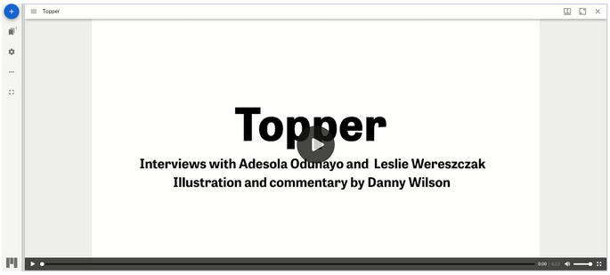
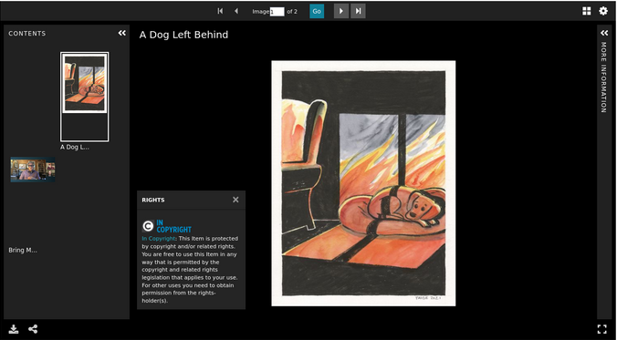

====================
Compound Object Work
====================

-----
About
-----

Compound object works are works that are made up of 2 or more works.  These works can be a combination of images, audio,
video, and/or books. Compound objects are special in that the works the objects consist of are significant enough that
they are able to stand alone in the wild in a system like the Digital Public Library of America. These sub parts have
significant metadata which should lead to their inclusion in OAI-PMH.  For the sake of user experience, parts of
compound objects may not be displayed as stand alone objects in the same collection of a parent compound object.

Compound object works are an ordered aggregation of :code:`1-n` :code:`pcdmuse:Work` s. Each member Work should have an
:code:`ore:Proxy` that has :code:`0-1` `iana:next` and :code:`0-1` :code:`iana:prev` properties that point to the next
or previous compound part in a sequence.  Since member works may stand alone elsewhere in the repository, the member
works do not have :code:`pcdm:memberOf` properties that point at the parent object. Instead, the parent work has a
:code:`pcdm:hasMember` property that points at child works. The parent work also points at :code:`ore:Proxy` s with
:code:`ore:proxyFor` and :code:`ore:proxyIn` properties that relate to the compound object parts via :code:`iana:first`
and :code:`iana:last` properties.

All compound objects’ individual works’ filesets should be available for download.

Book works within a compound object work should have OCR and HOCR.

All audio and video works within a compound object work may have :code:`0-n` closed-captioning / subtitle files that
should be associated with it in the viewer.

All filesets may have restrictions that prohibit view / access.

-------------------
Metadata Properties
-------------------

Descriptive Properties
======================

Descriptive properties are described in our
`vendor supplied MAP <https://docs.google.com/spreadsheets/d/1_0QVbQU_wj3ITUih5dGPGkWHN0QyhGO9hKSf6rXwKPc/edit#gid=0>`_.

Structural Properties
=====================

Suggested structure for a book is described here.

.. literalinclude:: ../fixtures/compound.ttl
    :language: turtle
    :linenos:

Technical Properties
====================

Technical properties are identified and listed in our
`metadata application profile <https://docs.google.com/spreadsheets/d/1_0QVbQU_wj3ITUih5dGPGkWHN0QyhGO9hKSf6rXwKPc/edit#gid=0>`_
in the files tab.

------------------
Viewing Experience
------------------

IIIF Viewer
===========

Compound object works should be displayed in a IIIF viewer such as Universal Viewer, Clover IIIF, or Mirador with an
:code:`individuals` behavior at the manifest level. The IIIF viewer should provide pan and zoom from the embedded
OpenSeaDragon viewer on image subworks and closed captioning on audio / video sub works. Our current IIIF configuration
along with “viewing experience” for compound objects is described in our
`Compound Objects recipe document <https://utk-iiif-cookbook.readthedocs.io/en/latest/contents/compound_objects.html>`_.

The :code:`pcdmuse:IntermediateFile` should always be represented in the viewer with any corresponding files (Transcripts).

A compound object with mixed media should look like this:

Location-based Viewing
======================

Our metadata currently includes cartographic and coordinate information so that the metadata record can be easily intermixed with a location-based viewer. An item should not be playable from this view, but it should pop out into a new window. We also include a URI that points at a Geonames object that includes this same information.

If needed, we can continue to store cartographic and coordinate information in a separate field to make this easy.

Some sample location-based display might be:

.. figure:: ../images/location_based_1.png
    :alt: Location-based Example 1

.. figure:: ../images/location_based_2.png
    :alt: Location-based Example 2

.. figure:: ../images/location_based_3.png
    :alt: Location-based Example 3

.. figure:: ../images/clemson_location.png
    :alt: Location-based Example 4

If possible, we would also like our location information to be shared as a :code:`navPlace` extension in our IIIF
manifests.

Rights Viewing
==============

While we store our rights as uris (see metadata application profile), we’d like these statements to be actionable and
render the appropriate badge and usage information to the user in both the IIIF viewer (when metadata is on) and in our
metadata display below.

File Viewer
===========

Users should be able to easily download the primary filesets.

If a fileset is only a `pcdm:PreservationFile` it should never be publicly visible.

.. figure:: ../images/file_download.png
    :alt: File Download Example

----------------
Interoperability
----------------

OAI-PMH
=======

Like other work types, compound works should be represented by an OAI-PMH record based on its metadata application
profile.  The work should be a record in an OAI set for each corresponding collection to which the work belongs. Unlike
other work types, members of compound objects should also be represented in collections in which they have a
:code:`pcdm:memberOf` relationship. Our metadata application profile should have a rule that states which field values
should be transformed to OAI-PMH for a given metadata format (simple dublin core, qualified DublinCore, DPLA?)

IIIF Image
==========

All images that are members of a fileset related to a compound object work should be served by a IIIF image service that
adheres to at least IIIF Image API 2.1.1 that supports most features described in
`5.3 profile description <https://iiif.io/api/image/2.1/#profile-description>`_. As part of work
type negotiation, we would like to know any features that the IIIF Image service does not support.

IIIF Presentation v3
====================

All compound object works should have a corresponding IIIF presentation v3 manifest that allows the object to be shared
and remixed in other projects. For our current system, we have a description of our current presentation 3 mapping in the
`corresponding recipe <https://utk-iiif-cookbook.readthedocs.io/en/latest/contents/compound_objects.html>`_.

-------
Bulkrax
-------

Import
======

Like all work types, images should be importable according to our Metadata Application Profile via Bulkrax import using
CSV and XXXXXXX file storage solution.

Export
======

In addition to import functionality, images should have a variety of export options including the ability to export only
filesets related to preservation for easy transfer to Chronopolis.  Those filesets should include:

* RDF about the :code:`pcdmworks:Work`
* RDF about the :code:`ore:Proxy`

**Note**:  all compound parts should be exportable via their own objects.

------------
Restrictions
------------

Like other work types, video works may have restrictions at the work and fileset / file level.

